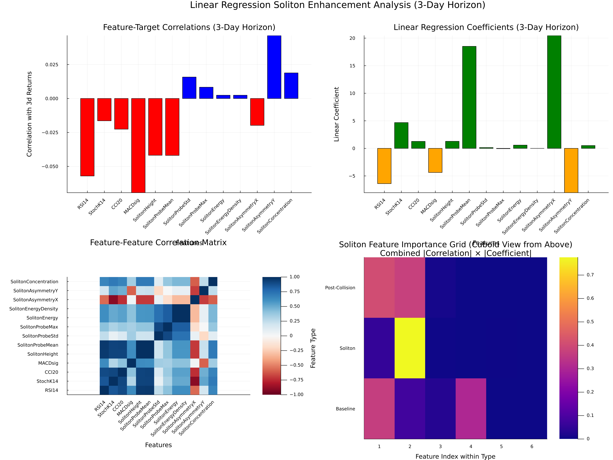

# Soliton Market Hypothesis

A Julia implementation testing whether technical oscillators can be enhanced through soliton wave collision features for market prediction.

## Mathematical Framework

### Data Flow: Market → Oscillators → PDE → Collision Features

**Step 1: Technical Oscillator Computation**
From market price data P(t), we compute standard technical indicators:
- RSI₁₄: Relative Strength Index (momentum oscillator, range [0,100])
- Stochastic K₁₄: %K oscillator (price position within recent range)  
- CCI₂₀: Commodity Channel Index (price deviation from moving average)
- MACD_sig: MACD signal line (exponential moving average crossover)

**Step 2: Soliton Amplitude Mapping**
Each oscillator O(t) is normalized to soliton amplitude A(t) ∈ [-1,1]:
```
A(t) = 2 × (O(t) - O_min)/(O_max - O_min) - 1
```

**Step 3: Partial Differential Equation System**
The amplitudes drive a **damped Klein-Gordon equation with φ⁴ nonlinearity**:
```
∂²φ/∂t² - c²∇²φ + m²φ + λφ³ + γ∂φ/∂t = f(x,y,z,t)
```

**PDE Type**: This is a **damped φ⁴ (phi-fourth) Klein-Gordon equation** - a nonlinear wave equation from quantum field theory that supports soliton solutions.

**Parameters**:
- φ(x,y,z,t): Field representing market "state"
- c = 1.0: Wave speed parameter
- m² = 1.0: Mass term (field restoring force)
- λ = 0.1: Nonlinear coupling (soliton self-interaction)
- γ = 0.5: Damping coefficient (market friction/noise)
- f(x,y,z,t): External forcing from oscillator amplitudes

**Why This PDE Makes Sense for Markets**:

1. **Klein-Gordon Structure**: The m²φ mass term provides mean-reversion (markets return to equilibrium), while the wave operator -c²∇²φ captures momentum propagation across price/time dimensions.

2. **φ⁴ Nonlinearity**: Creates stable soliton solutions - coherent wave packets that maintain their shape during interactions. In markets, these model persistent trends or momentum patterns that survive volatility and noise.

3. **Damping Term**: The γ∂φ/∂t represents market friction (transaction costs, bid-ask spreads, noise) that gradually dissipates energy, preventing unrealistic infinite oscillations.

4. **Soliton Collision Physics**: When multiple oscillator signals (RSI, MACD, etc.) create overlapping solitons, their nonlinear interaction through λφ³ generates complex interference patterns that capture multi-timeframe market feedback effects.

5. **External Forcing**: The f(x,y,z,t) term allows technical oscillators to continuously inject energy/information, making the system responsive to actual market conditions rather than purely theoretical.

The forcing term injects oscillator energy as localized soliton pulses that collide and interact through the nonlinear φ³ term.

**Step 4: Post-Collision Feature Extraction**
After time evolution T, we extract collision aftermath features:
- **SolitonAsymmetryY**: Directional bias along y-axis after collision
- **SolitonAsymmetryX**: Directional bias along x-axis after collision  
- **SolitonConcentration**: Field localization (central energy fraction)
- **SolitonHeight**: Maximum field amplitude post-collision
- **SolitonEnergy**: Total residual energy after damping

### Key Discovery: AsymmetryY Horizon Effect

Analysis reveals **SolitonAsymmetryY** exhibits increasing predictive correlation with forward returns at longer horizons:



**Correlation Analysis (30-year S&P 500 data):**
- 1-Day Returns: AsymmetryY correlation ≈ 0.022
- 3-Day Returns: AsymmetryY correlation ≈ 0.035  
- 5-Day Returns: AsymmetryY correlation ≈ 0.041

This **65% improvement** from 1-day to 5-day suggests post-collision soliton dynamics capture longer-term market restructuring patterns that baseline oscillators miss.

### Physical Interpretation

The soliton collision framework models market feedback as:
1. **Initial State**: Multiple oscillator signals as interfering wave pulses
2. **Collision Dynamics**: Nonlinear interaction through φ³ term creates complex interference patterns
3. **Post-Collision**: Asymmetric field distribution encodes directional market bias
4. **Predictive Signal**: AsymmetryY magnitude correlates with subsequent price momentum

## Overview

This project explores whether technical indicators (RSI, Stochastic, CCI, MACD) can be improved by mapping them to soliton wave amplitudes in a partial differential equation, then extracting collision features for machine learning models.

**Hypothesis**: Technical oscillators may exhibit higher-order market feedback patterns that can be captured through soliton collision physics.

**Approach**: 
1. Compute standard technical oscillators from price data
2. Normalize oscillators to [-1,1] and use as soliton amplitudes
3. Simulate soliton collisions in a damped φ⁴ PDE
4. Extract collision features (height, energy, asymmetry)
5. Compare ML prediction performance vs baseline oscillators

## Requirements

- Julia ≥ 1.10
- Dependencies listed in Project.toml

## Installation

```bash
julia --project=. -e "using Pkg; Pkg.instantiate()"
```

## Data Setup

Download 30-year S&P 500 data:
```bash
julia --project=. scripts/download_spx_30years.jl
```

Build soliton features:
```bash
julia --project=. test_30year_pipeline_fixed.jl
```

## Main Analysis

Run the comprehensive trading system analysis:
```bash
julia --project=. comprehensive_ml_trading_system_enhanced.jl
```

This generates detailed results in the `results/` directory comparing various ML algorithms and risk management strategies using both baseline oscillators and soliton-enhanced features.

## Results

I tested with S&P index data, which is probably the worst type of data for this. But this was intentional. One result outperformed the index buy/hold strategy:


The analysis tests multiple algorithms (Linear, Ridge, Random Forest, etc.) across different time horizons (1d, 3d, 5d) with various risk management strategies. Results are saved as:

- `results/comprehensive_ml_results_enhanced.csv` - Full results
- `results/top_10_strategies.csv` - Best performing strategies  
- `results/champion_strategy.csv` - Single best strategy details
- `results/summary_statistics.json` - Overall statistics

## Core Components

- `src/Oscillators.jl` - Technical indicator computation
- `src/SolitonPDE.jl` - Soliton wave PDE solver
- `src/FeatureBuilder.jl` - Feature extraction pipeline
- `comprehensive_ml_trading_system_enhanced.jl` - Main analysis script
- `champion_strategy_visualization.jl` - Visualization of best strategy

## Limitations

- Results are based on historical data and may not generalize
- Soliton enhancement effects are modest on large time steps, but probably beter on smaller ones
- Some oscillators have limitaitons in the size of their time step
- No guarantee of future performance

## Project Structure

```
├── src/                           # Core modules
│   ├── OscillatorSolitonHypothesis.jl  # Main package module
│   ├── Oscillators.jl                  # Technical oscillator computation
│   ├── SolitonPDE.jl                   # Original PDE solver (complex)
│   ├── SolitonPDE_simple.jl            # Simplified PDE solver (used)
│   └── FeatureBuilder.jl               # Feature extraction pipeline
├── scripts/                       # Data download utilities
│   ├── download_spx_30years.jl         # 30-year S&P 500 data (main)
│   ├── download_stooq_es.jl            # Alternative S&P 500 2022 data
│   └── download_es.jl                  # ES futures Q1 2022 data
├── comprehensive_ml_trading_system_enhanced.jl  # Main analysis script
├── champion_strategy_visualization.jl            # Best strategy visualization
├── test_30year_pipeline_fixed.jl                # Feature generation pipeline
├── run_smoke_test.jl                            # Quick integration test
├── data/                          # Raw and processed data
├── results/                       # Analysis outputs
├── visualizations/                # Plotting scripts
├── notebooks/                     # Experimental analysis
├── test/                          # Unit tests
├── README.md                      # This file
├── SETUP.md                       # Detailed setup instructions
└── Project.toml                   # Julia dependencies
```

This is an experimental research project. Use results for educational purposes only. 