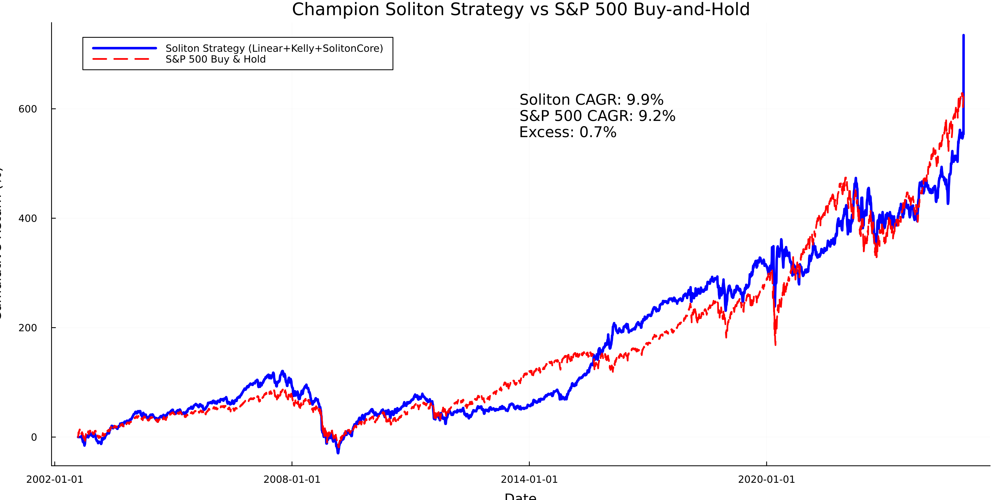

# Soliton Market Hypothesis

A Julia implementation testing whether technical oscillators can be enhanced through soliton wave collision features for market prediction.

## Overview

This project explores whether technical indicators (RSI, Stochastic, CCI, MACD) can be improved by mapping them to soliton wave amplitudes in a partial differential equation, then extracting collision features for machine learning models.

**Hypothesis**: Technical oscillators may exhibit higher-order market feedback patterns that can be captured through soliton collision physics.

**Approach**: 
1. Compute standard technical oscillators from price data
2. Normalize oscillators to [-1,1] and use as soliton amplitudes
3. Simulate soliton collisions in a damped φ⁴ PDE
4. Extract collision features (height, energy, asymmetry)
5. Compare ML prediction performance vs baseline oscillators

## Requirements

- Julia ≥ 1.10
- Dependencies listed in Project.toml

## Installation

```bash
julia --project=. -e "using Pkg; Pkg.instantiate()"
```

## Data Setup

Download 30-year S&P 500 data:
```bash
julia --project=. scripts/download_spx_30years.jl
```

Build soliton features:
```bash
julia --project=. test_30year_pipeline_fixed.jl
```

## Main Analysis

Run the comprehensive trading system analysis:
```bash
julia --project=. comprehensive_ml_trading_system_enhanced.jl
```

This generates detailed results in the `results/` directory comparing various ML algorithms and risk management strategies using both baseline oscillators and soliton-enhanced features.

## Results

I tested with S&P index data, which is probably the worst type of data for this. But this was intentional. One result outperformed the index buy/hold strategy:




The analysis tests multiple algorithms (Linear, Ridge, Random Forest, etc.) across different time horizons (1d, 3d, 5d) with various risk management strategies. Results are saved as:

- `results/comprehensive_ml_results_enhanced.csv` - Full results
- `results/top_10_strategies.csv` - Best performing strategies  
- `results/champion_strategy.csv` - Single best strategy details
- `results/summary_statistics.json` - Overall statistics

## Core Components

- `src/Oscillators.jl` - Technical indicator computation
- `src/SolitonPDE.jl` - Soliton wave PDE solver
- `src/FeatureBuilder.jl` - Feature extraction pipeline
- `comprehensive_ml_trading_system_enhanced.jl` - Main analysis script
- `champion_strategy_visualization.jl` - Visualization of best strategy

## Limitations

- Results are based on historical data and may not generalize
- Soliton enhancement effects are typically modest (single-digit improvements)
- Computational cost is higher than baseline oscillators alone
- No guarantee of future performance

## Project Structure

```
├── src/                           # Core modules
│   ├── OscillatorSolitonHypothesis.jl  # Main package module
│   ├── Oscillators.jl                  # Technical oscillator computation
│   ├── SolitonPDE.jl                   # Original PDE solver (complex)
│   ├── SolitonPDE_simple.jl            # Simplified PDE solver (used)
│   └── FeatureBuilder.jl               # Feature extraction pipeline
├── scripts/                       # Data download utilities
│   ├── download_spx_30years.jl         # 30-year S&P 500 data (main)
│   ├── download_stooq_es.jl            # Alternative S&P 500 2022 data
│   └── download_es.jl                  # ES futures Q1 2022 data
├── comprehensive_ml_trading_system_enhanced.jl  # Main analysis script
├── champion_strategy_visualization.jl            # Best strategy visualization
├── test_30year_pipeline_fixed.jl                # Feature generation pipeline
├── run_smoke_test.jl                            # Quick integration test
├── data/                          # Raw and processed data
├── results/                       # Analysis outputs
├── visualizations/                # Plotting scripts
├── notebooks/                     # Experimental analysis
├── test/                          # Unit tests
├── README.md                      # This file
├── SETUP.md                       # Detailed setup instructions
└── Project.toml                   # Julia dependencies
```

This is an experimental research project. Use results for educational purposes only. 